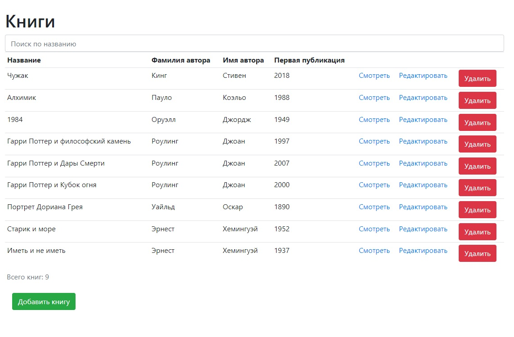
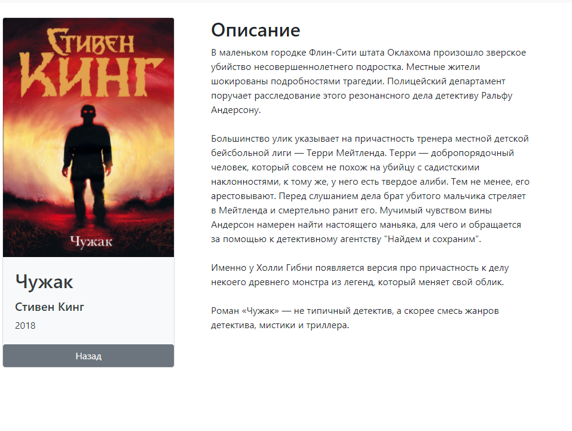
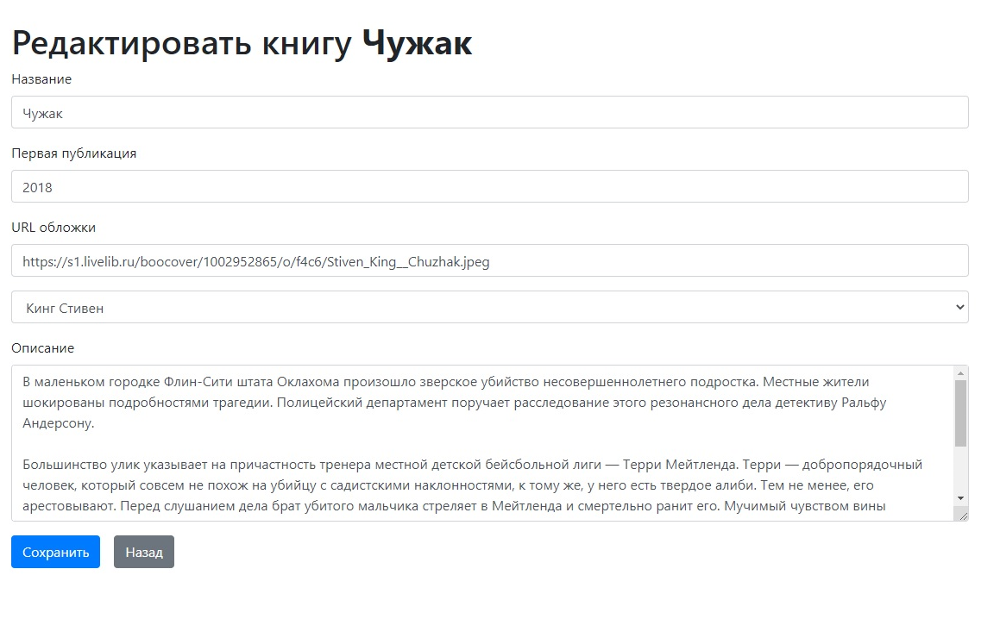
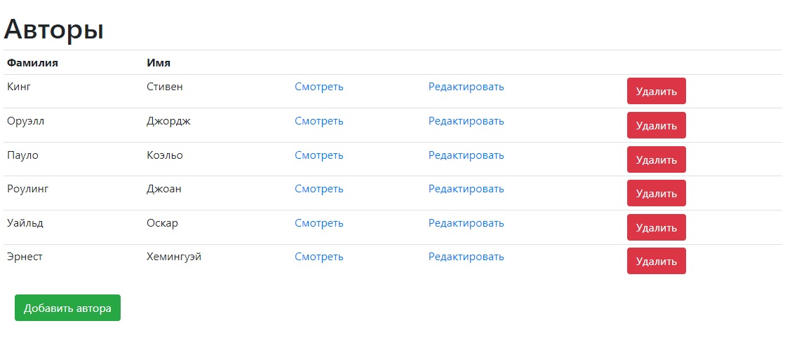

# Описание
Приложение представляет собой виртуальную библиотеку. Есть два типа данных - Автор и Книга. 
Каждая Книга привязана к конкретному Автору (только одному). 
В приложении есть возможность создания, просмотра, изменения, удаления Книг и Авторов. 
Данные хранятся в Firebase 
Реализовано на React + Redux + Firebase + MaterialUI

# Запуск
Для запуска приложения используйте поочередно команды:
1. <b>npm install</b>
1. <b>npm start</b>

# Внешний вид приложения
* Общий список книг

* Просмотр информации о книге

* Редактировать информации о книге

* Общий список авторов

